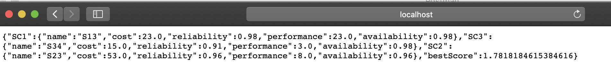
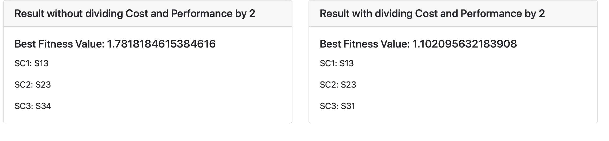

#ReadMe For SOC2020 18655 Assignment 5 - Bolun Zhang

## 0. Code Structure -- Important file locations
    /app
        /controllers
            /ApiConotroller                 Controller For APIs, including the Webpage and API
            
        /GAs
            /BestCombinationFitnessFunction Fitness function for genetic algorithms
            /MaximazingScore                Genetic algorithm initializer
        
        /item
            /Service                        Class to store service data
            /Weight                         Class to store Qos Weight
        
        /fileReaders
            /DataFileReader                 Interface for All file readers
            /TextFileReader                 File reader for text files
            /WordFileReader                 File reader for word files
        
        /views
            /index.scala.html               Home Page
            /main.scala.html                Main Template Layout
    
    /conf
        /application.conf                   Configuration file for database connection, LDA and Mallet
        /routes                             Configuration file for routes
    
    /resources                              Source files for readMe and basic files for API
        /screenshots                        Screenshots for Results of API and Webpage
        /data.txt                           Txt file to read from
        /Lab Sample Input.docx              Word File to read from
    
    /lib                                    jgap jar files, don't delete

## 1. Configuration
  All configuration are located in /conf/application.conf
    
  
  ### Data File Config
    textPath = "/resources"           //Path for data.txt => RootPath + textPath + "/data.text" 
    wordPath = "/resources"           //Path for Lab Sample Input.docx => RootPath + wordPath + "/Lab Sample Input.docx"
  
## 2. API Documentation

   Like last time, a detailed documentation of APIs, with example, can be accesses at 
   
   [SOC2020 Assignment 5 API document - Bolun Zhang](https://documenter.getpostman.com/view/7605429/SzezaWRS?version=latest) 
   
   A little bit of guide for /api/ga
   
   To use data.txt I created myself as the source of data, set query parameter fileType to "text"
   
   To use the original docx as the source of data, set query parameter fileType to "word"
   
   To use the default Integer gene as genes for Chromosome, set query parameter geneType to "Integer"(Capital first letter)
   
   To use the boolean gene as genes, set query parameter geneType to "Boolean"(Capital first letter)
   
   To divide the cost and performance by 2 after normalization, set doubleNormal to 2 (This will be explained in the Part 4, fitness function)
   
## 3. Run web service
   ### Prerequisites
   Java 1.8, Play 2, Sbt, jgap, Apache Poi, Apache Common
   
   ### Start the service
   Import the service into Intellij
   
   Click Run and edit configuration
   
   Start the web service with desired port, preferably 9005
   
   To get the default API result, call to {{host}}:{{port}}/api/ga
   
## 4. Fitness Function Explaining

   The fitness function overall works in the following flow
   
   0) Before the genetic algorithm start, the function class will read the service data from the chosen type of files and store them
   
   1) Take the Chromosomes and convert it into three numbers representing locations of the chosen services in their clusters
   
   2) Extract the chosen services from the stored services, generate temporary services S1, S2, S3 with normalized cost and performance
   
   3) Calculate W1 using S1 and S2 in a Sequential relationship
   
   4) Calculate W2 using W1 and S1 in a Parallel relationship
   
   5) Calculate W3 using W2 and S3 in a Sequential relationship
   
   6) Calculate fitness score using W3's cost, performance, reliability and availability and Weight of Qos
   
   ### 4.0 Different file source
   It was difficult to read from the docx file at the beginning, so I created a txt file called data.txt with the cluster information inside and created a fileReader called TextFileReader
   
   Later I figured out how to read the docx file with XWPF of Apache POI and created a second file Reader called WordFileReader
   
   Both fileReader inherit from DataFileReader Interface and can be replaced in run time. Refer to Part 2 of the ReadMe: API documentation
   
   ### 4.1 Gene Type for Chromosomes
   For this assignment, I used 2 different types of Chromosome.
   
   First type of chromosome uses 3 IntegerGenes provided by jgap. Each corresponds to a service cluster and range from 0 to size of the cluster -1
   
   Second type of chromosome uses 8 BooleanGenes, and are based on what Professor talked about in class
   
   More about the Genes will be talked about in part 5 of the ReadMe
   
   ### 4.2 Retrieve Service from storage
   Using the indexes generated from the last step, the function will get the service from what's stored after fileReader read the file.
   
   The stored services are inside a 2 dimension Array of Service
   
   Note that when using BooleanGenes, certain index will exceed the bound, in this case, the evaluate function will immediately return 0 as this Chromosome's fitness score
   
   ### 4.3 Normalization
   The normalization of the cost and performance are a bit tricky.
   
   As being told by the professor, cost and performance of a service should be normalized to between 0 and 1
   
   To achieve this, I used the sum of cost/performance of S1, S2, S3 as total 1 and get the normalized cost or performance as 1-(cost/totalCost)
   
   Normally this will be good enough, and you can access it by calling the API with doubleNormal set to false
   
   However, with a bit more digging, I find a little bit of problem with this method:
        
        If s1 got c(s1) = 1- s1.cost/totalCost and s2 got c(s2) = 1-s2.cost/totalCost
        
        The cost of W1 will be c(s1)+c(s2) = 2- (s1.cost+s2.cost)/totalCost
        
        With totalCost = s1.cost + s2.cost + s3.cost, (s1.cost+s2.cost)/totalCost will be smaller than 1
        
        And c(W1) will be bigger than 1
   
   So, in order to solve(at least partially) this problem, I divided each normalized value by 2. Thus c(s1)=(1-s1.cost/totalCost)/2
   
   You can see the result of this by setting doubleNormal to true in the API
   
   I included both of these normalizations(Divide by 2 or not) because even for the second one, I still have some doubts
   
   Reason is, using what we've been taught in class by Professor Zhang, the cost for W3 will still be bigger than 1 because s1.cost is included twice in the whole function
   
   ### 4.4 Sequential Relationship
   If w1 is generated using S1+S2 with a sequential relationship

    c(w1) = c(S1) + c(S2)
    p(w1) = p(S1) + p(S2)
    r(w1) = min(r(S1) + r(S2))
    a(w1) = min(a(S1) , a(S2))
    
   ### 4.4 Sequential Relationship
   If w1 is generated using S1+S2 with a parallel relationship

    c(w1) = c(S1) + c(S2)
    p(w1) = max(p(S1) , p(S2))
    r(w1) = r(S1) * r(S2)
    a(w1) = a(S1) * a(S2) 
    
   ### 4.5 Fitness Score
   The weight for the fitness function are set to 35% 10% 20% 35%
   
   The final fitness score would be 35%*c(W3)+10%*r(W3)+20%*p(W3)+35%*a(W3)
   
### 5. The mapping from business question into the digital world in chromosomes and genes.
   In this assignment, we are told to convert Services that operate with a certain flow into something runnable using a genetic algorithm
   
   A fitness function is created to convert different quality attribute of the services into a evaluable score and has been covered in the previous part
   
   Thus, we need to convert each service from service clusters into genes and the combinations of these services into chromosomes
   
   I implemented this in 2 ways
   
1. IntegerGenes in Chromosome
   
   Jgap has provided this very useful type of Genes that set the lower bound and upper bound of a certain type of entity
   
   In our case, each gene represent the index of a service inside its service cluster, and there are in total 3 genes
   
   For example,
   Gene g1 = new IntegerGene( , 0, 4) Represent a service cluster with 5 service and each number from 0 to 4 represent the index of a service
   
   So after evolving, to get the service from this service cluster, just get the value of the gene and use it as index to locate the service inside the service cluster
   
2. BooleanGenes in Chromosome
   
   This is a implementation that uses what Professor taught in class.
   
   In this one, 2 or 3 genes will represent the index of a service inside its service cluster, and there are in total 8 genes
   
   For SC1, 3 genes are used for a total of 5 services.
   
   For SC2, 2 genes are used for a total of 3 services.
   
   For SC3, 3 genes are used for a total of 8 services.
   
   To illustrate how to calculate the index using the genes, consider for SC1, we got gene1 = false, gene2 = true and gene3 = true
   
   This would convert to 011 and using binary knowledge this would point to index 3, the fourth service in the service cluster
   
   This method will create useless Chromosome that are not possible to achieve as there might be a index bigger than SC1 or SC2's bound
   
   In this case, the fitness function will give a score of 0 and move to the next one.
   
   In theory, there are in total 120 valid cases and 256 cases for 8 BooleanGenes, so 136 cases will be useless
   
### Screenshots for result of webservices are under [./resources/screenshots](resources/screenshots)

  